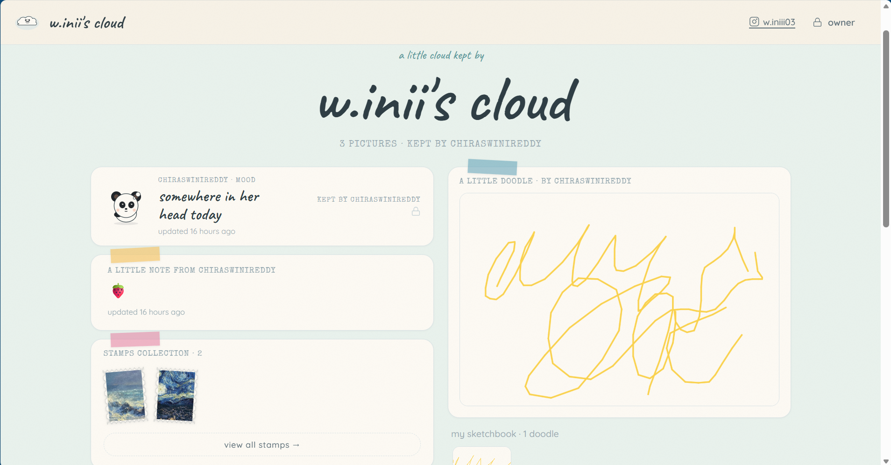
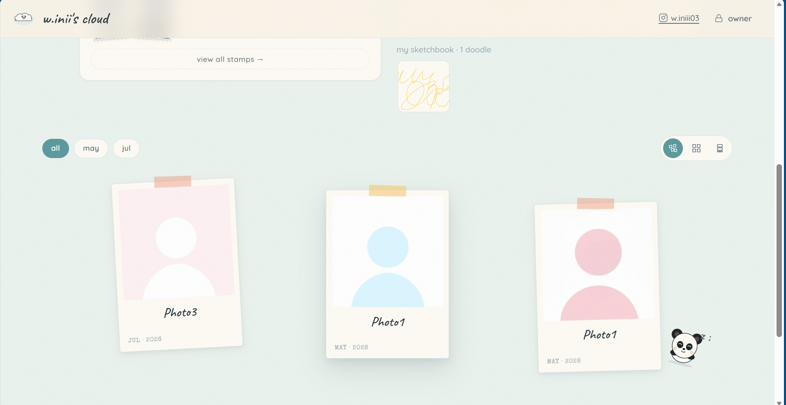
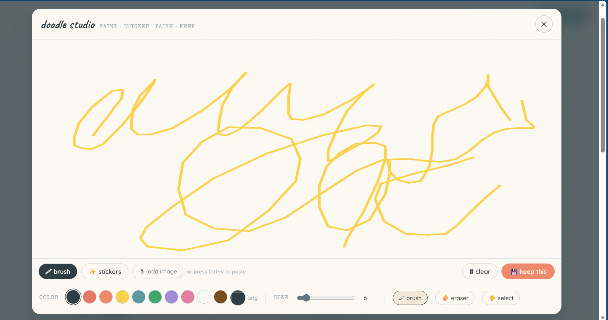
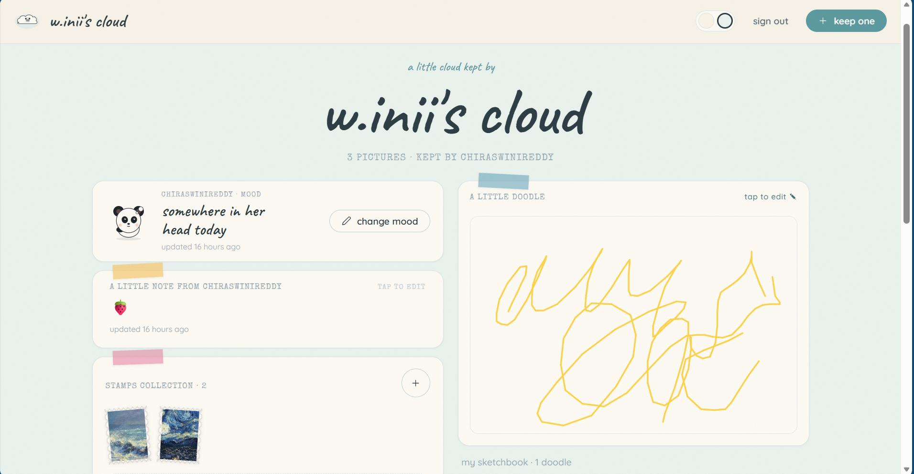

# w.inii's cloud ☁️

> A full-stack keepsake web app — a soft little corner of the internet for photos, moods, daily notes, doodles, and postage-stamp memories. **Anyone can browse; one authenticated owner signs in to add and edit everything, live.**


-FAB005)



Built solo as a learning project to wire a **real database, authentication, file storage, and realtime sync** into a no-build React front end — and ship it online.

---

## 🧰 Tech stack

| Layer | Tool | What it does here |
|---|---|---|
| **Frontend** | React 18 (in-browser Babel) | UI, state, no build step — ships as static files |
| **Database** | Supabase Postgres | stores photos, moods, notes, doodles, stamps |
| **Auth** | Supabase Auth | email/password sign-in for the single owner |
| **Security** | Row-Level Security | public reads, owner-only writes — enforced server-side |
| **Storage** | Supabase Storage | photo & doodle image uploads |
| **Realtime** | Supabase Realtime | visitors see edits the instant they happen |
| **Hosting** | Netlify | continuous deploy, static hosting |

---

## ✨ Features

- **Memory feed** — polaroid photos with caption, date, and location
- **Mood** — pick today's mood; shows when it was last updated
- **Daily note** — a short message with a last-updated timestamp
- **Doodle studio** *(owner)* — full-screen canvas with brush, any-colour picker, cute stickers (pandas · beach · sweets), paste-any-image, and Instagram-story–style drag / resize / rotate
- **Sketchbook** — saved doodles in a browsable archive
- **Stamps** — a postage-stamp-shaped photo collection
- **Live sync** — visitors see updates in real time
- **Owner-only editing** — protected by Supabase Auth + Row-Level Security

---

## 📸 More screenshots

**The photo feed** — polaroid memories with captions and dates:



**The doodle studio** — full canvas with brush, stickers, colours, and paste-any-image:



**Owner mode** — once signed in, editing controls appear (change mood, keep a photo, doodle, sign out):



---

## ⚙️ How it works

```
Visitor ─┐
         ├─►  React app (static files on Netlify)
Owner  ──┘                │
                          ├─► reads  ──► Supabase Postgres   (public, anyone)
                          ├─► writes ──► blocked unless signed-in owner (RLS)
                          ├─► uploads ─► Supabase Storage      (photos, doodles)
                          └─► realtime ◄ live updates pushed to every open page
```

- There is **no server I wrote** — Supabase is the backend, and the rules live *in the database*, not the UI.
- The owner signs in; their session is checked against **Row-Level Security policies** before any write is allowed. A visitor editing the page in dev-tools still can't change a thing.
- When the owner saves, a **Realtime subscription** pushes the change to every visitor's screen instantly — no refresh.

---

## 🛠️ What this project demonstrates

- **React 18** component architecture with no bundler — JSX transpiled in the browser, app ships as static files
- **Relational data modelling** — tables, columns, and storage buckets provisioned from a single SQL script
- **Authentication** — email/password sign-in scoped to one owner account
- **Server-side authorization** — Row-Level Security, not UI-only guards
- **File storage** — image uploads with public read URLs
- **Realtime subscriptions** — push-based live updates
- **Deployment** — continuous deploy to a static host

---

## 💭 Why I built this & what I learned

I made this because I love building things — turning an idea in my head into something real on a screen is the part of coding that makes me happy. It started as a small personal site and grew as I kept asking *"okay, but can I also make it do **this**?"*

A few things I figured out along the way:

- **Connecting a real backend was the big leap.** Before this, my projects only lived in the browser. Learning to store photos, notes, and doodles in a real database — and have them *stay* there — felt like a different level.
- **Security isn't just hiding a button.** My first instinct was to hide the editing controls from visitors. Then I learned anyone could get around that, and that real protection has to live on the server. Setting up Row-Level Security so only the owner can change anything was the hardest and most satisfying part.
- **Realtime is magic.** Getting the page to update on its own the moment something changes still makes me smile.
- **Shipping it for real.** Putting it online as an actual link, not just a file on my laptop, made it feel finished.

I'm still early in my journey and there's plenty I'd do differently next time — but I'm proud of this one, and I had a lot of fun making it.

---

## 📁 Project structure

```
.
├── index.html              # entry point — loads everything
├── colors_and_type.css     # design tokens (colours + fonts)
├── src/
│   ├── app.jsx             # root component + state + data wiring
│   ├── components.jsx      # header, polaroid, buttons, icons…
│   ├── screens.jsx         # feed, hero, lightbox, upload, mood, note
│   ├── paint-board.jsx     # doodle studio + sketchbook
│   ├── sticker-library.jsx # SVG sticker set
│   ├── stamps.jsx          # stamp collection
│   ├── tweaks-panel.jsx    # in-app tweak controls
│   ├── panda-urls.js       # inlined panda sticker images
│   └── supabase-client.js  # all backend calls (window.SB)
└── supabase/
    └── setup.sql           # one-shot database + storage + policies setup
```

---

## 🚀 Run it yourself

### 1. Supabase
1. Create a project at [supabase.com](https://supabase.com).
2. Open **SQL Editor → New query**, paste the contents of [`supabase/setup.sql`](supabase/setup.sql), and **Run**.
3. **Authentication → Users → Add user** — create the owner account (email + password, with *Auto Confirm* on).
4. Put your project URL and **publishable** anon key into [`src/supabase-client.js`](src/supabase-client.js):
   ```js
   const SUPABASE_URL      = 'https://YOUR-PROJECT.supabase.co';
   const SUPABASE_ANON_KEY = 'YOUR-PUBLISHABLE-KEY';
   const OWNER_EMAIL       = 'you@example.com';
   ```
   > The anon/publishable key is safe to commit — it's a public client key. All write access is enforced server-side by Row-Level Security.

### 2. Run locally
No build needed. Serve the folder with any static server:
```bash
npx serve .
# or
python3 -m http.server
```

### 3. Deploy (Netlify)
Connect the repo to Netlify (or drag the folder into the dashboard). No build command; publish directory is the repo root. `netlify.toml` is already configured.

---

## 🔑 Owner vs visitor

- **Visitors** see everything, read-only.
- Click **owner**, sign in, and editing controls appear — add photos, change mood/note, open the doodle studio, set the background. **Sign out** returns to visitor mode.

---

## 📝 Note on config

`src/supabase-client.js` ships with real config values. The anon/publishable key is meant to be public, but you may want to swap `OWNER_EMAIL` for a dedicated address before sharing widely. Data stays protected by Row-Level Security either way.

---

Made with 💛
